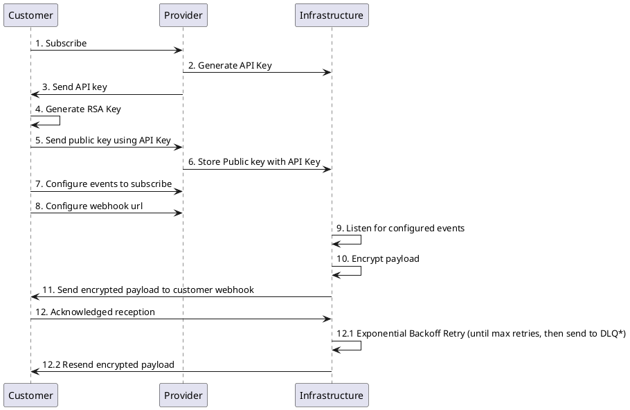
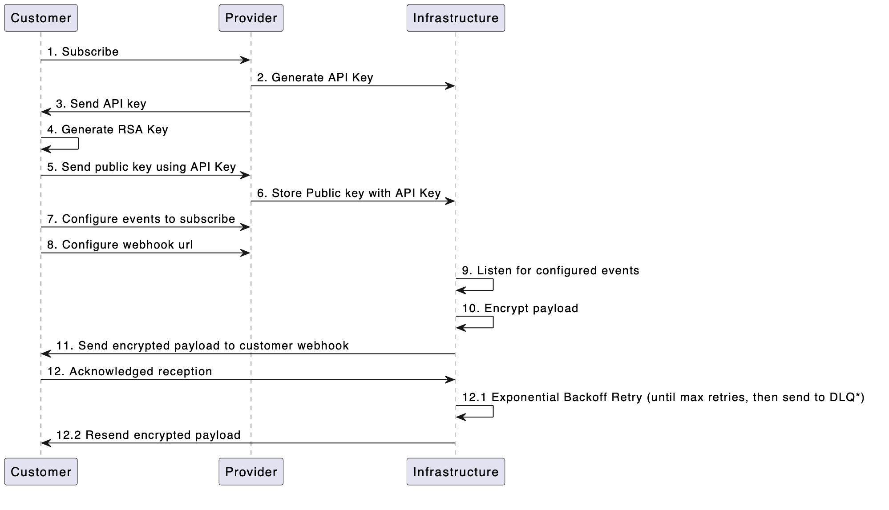
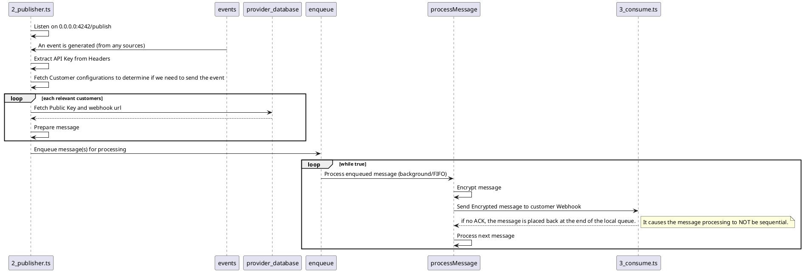
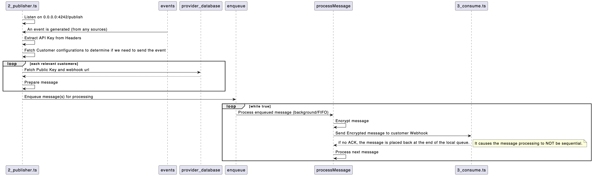
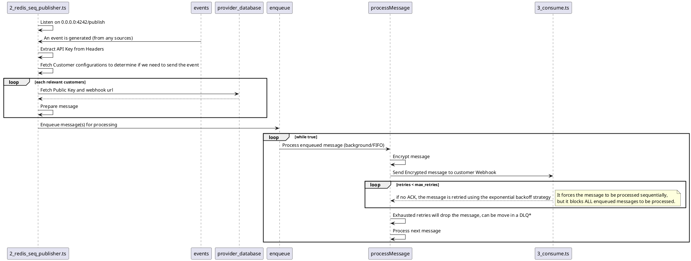
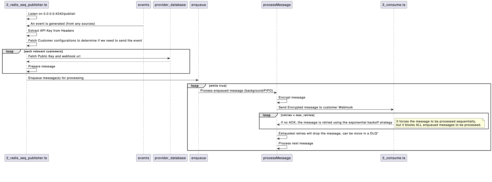
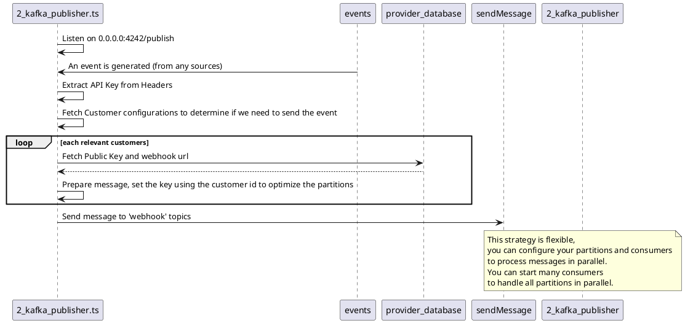
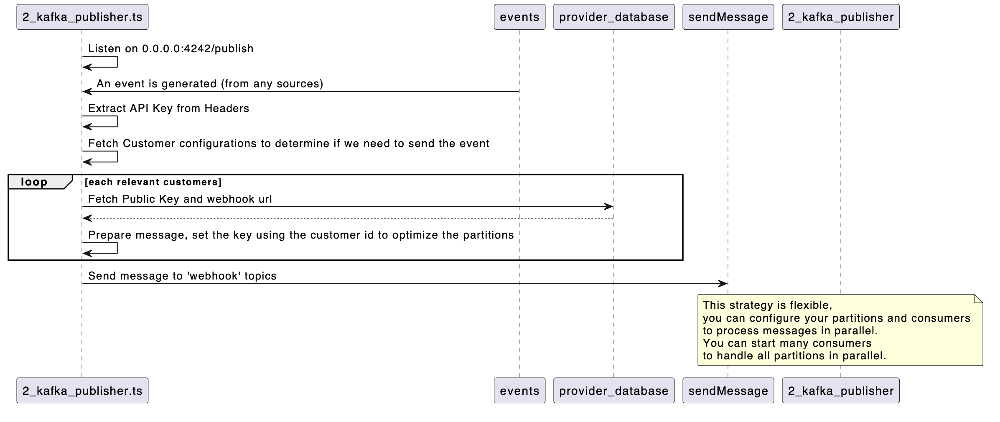
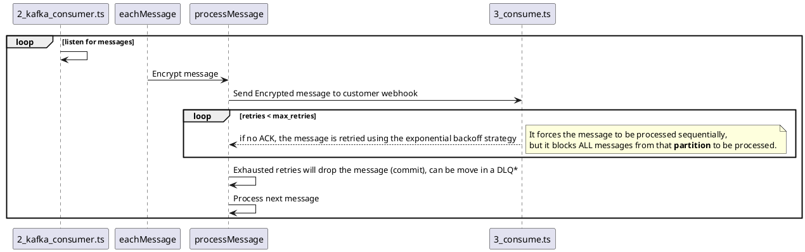
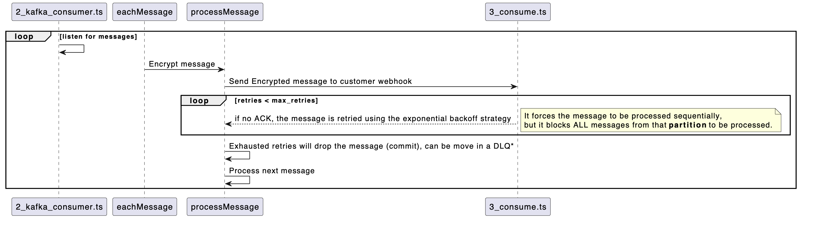

<div align="center">

<h2>Secure, Multi-Tenant Webhook System</h2>

<p align="center">
  <a href="https://github.com/studiowebux/webhook/issues">Report Bug</a>
  ·
  <a href="https://github.com/studiowebux/webhook/issues">Request Feature</a>
</p>
</div>

---

This system ensures secure, isolated communication channels for each client
through encrypted webhooks. Each tenant has a unique encryption setup, enhancing
data privacy and security across all interactions. Additionally, it incorporates
exponential backoff strategies to manage retries efficiently, optimizing
reliability and performance during transient failures.

## Usage

**Terminal #1**

```bash
deno run -A 1_generate_keys.ts
```

**Terminal #2**

_In Memory_

```bash
deno run -A 2_publisher.ts
```

OR

_Note: FIFO by default (RPUSH/LPOP), but retries are NOT FIFO._

```bash
deno run -A 2_redis_publisher.ts
```

_If sequential retries are required, you must handle them in-code and block the
processing until the message is successfully processed or dropped_

```bash
deno run -A 2_redis_seq_publisher.ts
```

_If sequential retries are required, you must handle them in-code and block the
processing until the message is successfully processed or dropped_

```bash
deno run -A 2_kafka_publisher.ts
```

You can start multiple consumers (I tested with 3 consumers and 3CC each), this
way it can process your customer(s) in parallel and each partition is processed
sequentially. (the `key` is used for partitioning, in these example I used
`customer-X`)

```bash
deno run -A 2_kafka_consume.ts
```

**Terminal #3**

This server simulate a customer (Will probably not run in your local
infrastructure) This is the endpoint we (the provider) send encrypted message
to, that consumer has to decrypt the message using its private key.

```bash
deno run -A 3_consume.ts
```

**Back in Terminal #1**

_To test in-memory and redis_

```bash
bash 4_publish.sh
```

_To test kafka_

```bash
bash 4_kafka_publish.sh
```

## Architecture

### General Flow


<details>

<summary>PlantUML Code</summary>



</details>



### In Memory

<details>

<summary>PlantUML Code</summary>



</details>



### Redis

The `2_redis_publisher.ts` is exactly the same flow as the `2_publisher.ts`, with the exception that the data is persisted when the server restarts.

**Sequential processing**

<details>

<summary>PlantUML Code</summary>



</details>



### Kafka

`0_kafka_setup.ts` is required to setup the partitions.

<details>

<summary>PlantUML Code</summary>



</details>



<details>

<summary>PlantUML Code</summary>



</details>



## Deno OTEL

```bash
OTEL_DENO=true deno run --unstable-otel ...
```

## Distributed System (Optional)

```bash
docker run --restart always --name webhook -p 6379:6379 -d redis redis-server --save 60 1 --loglevel warning
```

```bash
docker run -d \
--name=kafka-kraft \
-h kafka-kraft \
-p 9092:9092 \
-e KAFKA_NODE_ID=1 \
-e KAFKA_LISTENER_SECURITY_PROTOCOL_MAP='CONTROLLER:PLAINTEXT,PLAINTEXT:PLAINTEXT,PLAINTEXT_HOST:PLAINTEXT' \
-e KAFKA_ADVERTISED_LISTENERS='PLAINTEXT://kafka-kraft:29092,PLAINTEXT_HOST://localhost:9092' \
-e KAFKA_JMX_PORT=9101 \
-e KAFKA_JMX_HOSTNAME=localhost \
-e KAFKA_PROCESS_ROLES='broker,controller' \
-e KAFKA_OFFSETS_TOPIC_REPLICATION_FACTOR=1 \
-e KAFKA_CONTROLLER_QUORUM_VOTERS='1@kafka-kraft:29093' \
-e KAFKA_LISTENERS='PLAINTEXT://kafka-kraft:29092,CONTROLLER://kafka-kraft:29093,PLAINTEXT_HOST://0.0.0.0:9092' \
-e KAFKA_INTER_BROKER_LISTENER_NAME='PLAINTEXT' \
-e KAFKA_CONTROLLER_LISTENER_NAMES='CONTROLLER' \
-e CLUSTER_ID='MkU3OEVBNTcwNTJENDM2Qk' \
confluentinc/cp-kafka:7.9.0
```

Then Setup your kafka partitions:

```bash
# Yes, the script hangs from time to time...
deno run -A 0_kafka_setup.ts

kafka-topics --bootstrap-server localhost:9092 --describe --topic events
```

## Observability

```bash
docker run --name lgtm -p 3000:3000 -p 4317:4317 -p 4318:4318 -d \
	-v "$PWD"/lgtm/grafana:/data/grafana \
	-v "$PWD"/lgtm/prometheus:/data/prometheus \
	-v "$PWD"/lgtm/loki:/data/loki \
	-e GF_PATHS_DATA=/data/grafana \
	docker.io/grafana/otel-lgtm:0.10.0
```

## License

Distributed under the MIT License. See LICENSE for more information.

## Contact

- Tommy Gingras @ tommy@studiowebux.com

---

<a href="https://www.buymeacoffee.com/studiowebux" target="_blank"
        ></a>
